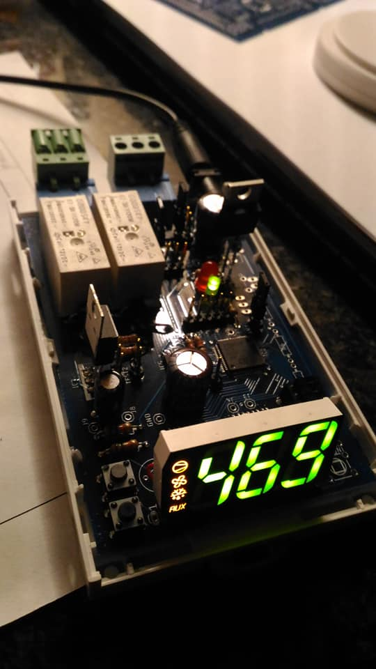
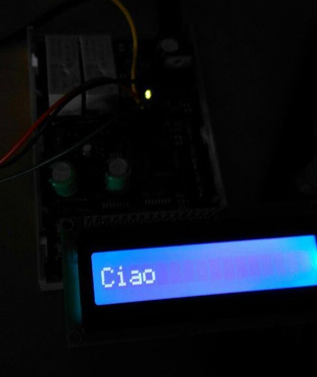
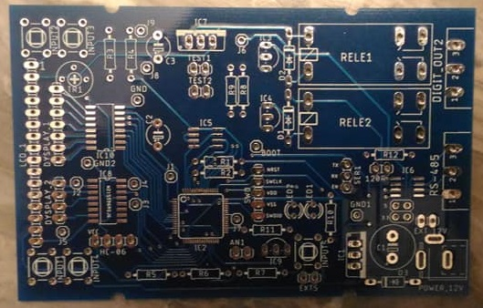
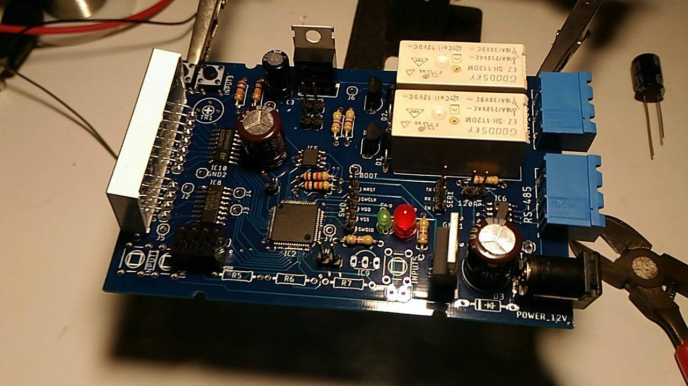

# STM32F030RC Electronic Board

  

## Project Description
This electronic board based on **STM32F030RC** is designed for controlling and managing devices through **relays**, **displays**, and **temperature sensors**. It supports advanced serial communications and can interface with RS-485 and Bluetooth (HC-06) devices.

## Main Features
- **Microcontroller:** STM32F030RC
- **2 relays** for controlling external devices
- **Support for two displays**:
  - **7-segment display**
  - **Graphical LCD display**
- **Temperature sensor** LM35 (internal or external)
- **Communication interfaces:**
  - **RS-485** for industrial connections
  - **TTL serial** compatible with Bluetooth HC-06 module
  
  
  

## Board Image
  

## Components Used
- **STM32F030RC** (ARM Cortex-M0 microcontroller)
- **Relay Module** (x2)
- **7-segment display**
- **Graphical LCD display**
- **LM35 temperature sensor**
- **RS-485 converter**
- **Bluetooth HC-06 module**

  

## Installation & Usage
1. **Connect external devices** according to the circuit schematic.
2. **Upload the firmware** to the STM32F030RC microcontroller using the programming interface.
3. **Configure communication**:
   - RS-485 for wired connections
   - Bluetooth HC-06 for wireless connection
4. **Monitor data** from the displays and temperature sensors.
5. **Activate or deactivate relays** based on the firmware logic.

## Example Use Cases
- **Industrial Automation**: Actuator control and parameter monitoring.
- **Home Automation**: Remote management of electronic devices via Bluetooth or RS-485.
- **Monitoring Systems**: Reading and transmitting data from temperature sensors.